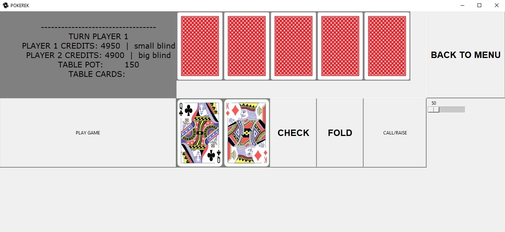
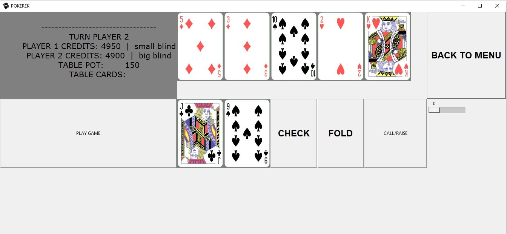
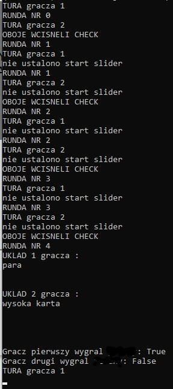

  


# Description
Poker game from scratch using Tkinter and OOP

Heads up means that you play 1 vs 1

## Requirements

```bash
1. numpy
2. pandas
3. pillow
```
## USAGE

```bash
Console version --> run pokerv2.py
GUI version     --> run GUIv4.py
```

### TODO:
* Finance system (e.g. bets)
* AI

# Exapmle screens from game
* MENU


* PREFLOP


* RIVER


* CONSOLE LOGS

